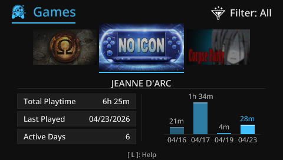
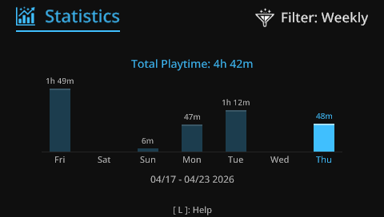

[](https://github.com/OniMock/GameDiary/actions)
[](LICENSE)
[](https://en.wikipedia.org/wiki/PlayStation_Portable)

[](https://github.com/OniMock/GameDiary/releases)


# 🎮 GameDiary

> Your handheld gaming history, beautifully tracked.

**GameDiary** is a seamless background playtime tracker and stats visualizer for the PlayStation Portable. It bridges the gap between retro hardware and modern ecosystems by automatically building a premium, localized dashboard of your gaming habits.

<p align="center">
  
</p>

---

## Table of Contents

1. [Overview](#overview)
2. [Features](#features)
3. [Screenshots / UI](#screenshots--ui)
4. [How It Works](#how-it-works)
5. [Installation](#installation)
6. [Usage](#usage)
7. [Project Structure](#project-structure)
8. [Configuration](#configuration)
9. [Development](#development)
10. [Plugin Details](#plugin-details)
11. [Roadmap](#roadmap)
12. [Contributing](#contributing)
13. [Support](#support)
14. [License](#license)
15. [Credits](#credits)
16. [Author](#author)


---

## 📖 Overview

**GameDiary** is a background kernel-mode plugin (PRX) and a premium user-mode application (EBOOT) for the PlayStation Portable (PSP).

It exists to give PSP power-users modern, console-like play tracking capabilities. GameDiary automatically monitors the games you play (both native PSP titles and PS1 classics via POPS), records your session lengths, extracts the game icons behind the scenes, and presents all your gaming statistics in a beautiful, modern, and fluid UI.

**Key Benefits:**
* Never lose track of your gaming hours.
* Revisit your gaming history via rich, data-driven graphs.
* Works entirely in the background without affecting game performance.

---

## ✨ Features

### ⚙️ Core
* **Seamless Background Tracking**: Minimal footprint kernel plugin starts silently with your games and records your playtime accurately.
* **Automatic Icon Management**: Automatically extracts `ICON0.PNG`
from EBOOTs and ISOs for a rich visual diary without manual scraping.
### 🎨 UI / UX
* **Premium User Interface**: Fluid carousel navigation, smooth transitions, depth-sorted overlapping icons, and dynamic backgrounds built from the ground up to feel like native OS features.
* **Sharp SDF Font Engine**: Custom Multi-Page MSDF rendering pipeline delivers perfectly crisp text at any font size without pixelation or stair-stepping.
* **Comprehensive Stats**: View total playtime, session history, and detailed graphs.

### 🧩 System
* **Global Internationalization (i18n)**: Fully localized in English, Spanish, Portuguese, Russian, Japanese, and Chinese with automatic language detection based on PSP system settings.
* **POPS Compatibility**: Reliable tracking and icon parsing for PlayStation 1 classics running via the official emulator.

---

## 🖼️ Screenshots / UI

| Home / Carousel | Session Statistics |
| :---: | :---: |
|  |  |
| *Fluid infinite-scrolling game carousel with depth sorting.* | *Detailed left-aligned session statistics with playtime graphs.* |

---

## ⚙️ How It Works

GameDiary operates in two layers:

1. Kernel Plugin (PRX)
   - Tracks game sessions in real-time
2. User Application (EBOOT)
   - Reads and visualizes collected data

## 📦 Installation

### 📋 Requirements
* A PlayStation Portable (PSP 1000/2000/3000 or Go).
* Custom Firmware (CFW) installed (such as PRO, ME, or ARK-4).
* A Memory Stick (or MicroSD to MS adapter).

### 🗂️ Folder Preparation
Ensure you have the latest release downloaded from the [Releases](https://github.com/OniMock/GameDiary/releases) page. The release contains two main components: the App and the Plugin.

### 1. Installing the Plugin (Tracker)
1. Copy the `gamediary.prx` file to your `seplugins` folder on your memory stick (`ms0:/seplugins/` or `ef0:/seplugins/` for PSP Go).
2. Open `ms0:/seplugins/game.txt` in a text editor.
3. Enable plugin:
    - For ARK-4:
        + Add the following line to enable tracking for PSP games:
        ```text
        psp, GameDiary.prx, on
        ```
        + To enable PS1 games tracking also add the following line:
        ```text
        ps1, GameDiary.prx, on
        ```
    - For other CFWs:
        + Add the following line to enable tracking for PSP games:
        ```text
        ms0:/seplugins/gamediary.prx 1
        ```
        *(Use `ef0:/seplugins/gamediary.prx 1` if using a PSP Go's internal storage).*
        + Do the same for `ms0:/seplugins/pops.txt` to enable PS1 tracking
4. Do the same for `ms0:/seplugins/pops.txt` to enable PS1 tracking.
5. Restart your PSP (or reset VSH).

### 2. Installing the Application (Viewer)
1. Extract the `GameDiary` app folder.
2. Navigate to `ms0:/PSP/GAME/`.
3. Copy the `GameDiary` folder there. Your absolute path should look like `ms0:/PSP/GAME/GameDiary/EBOOT.PBP`.

---

## 🚀 Usage

### ▶️ Launching the App
Simply navigate to your PSP's **Game** menu on the XMB and launch **GameDiary** like any other homebrew.

### 🎮 Controls

| Button | Action |
| :--- | :--- |
| **D-Pad Left/Right** | Navigate carousel / Change tabs |
| **Analog Stick** | Smooth scrolling through the game carousel |
| **Cross (X) / Circle (O)** | Confirm / Back (Respects your PSP's X/O region setting) |
| **Square (□)** | Toggle Game Category filter |
| **START** | Open Main Dashboard Menu |
| **SELECT** | Open Settings Menu (Language, Support, About) |
| **L-Trigger** | Open context-sensitive Help Popup |

### 🔄 Example Workflows
1. **Playing a game**: Boot up a UMD or ISO. The plugin silently detects the game ID, extracts the icon if missing, and begins tracking your playtime.
2. **Reviewing stats**: Run the GameDiary Application from the XMB. Scroll through the carousel to find your game, hit **X** (or **O**) to view your weekly and all-time playtime statistics.

---

## 🏗️ Project Structure

A clean, modular architecture separating kernel plugin operations from user-mode presentation.

```
GameDiary/
├── Makefile                # Build orchestration
├── include/                # Shared headers and public APIs
├── src/
│   ├── app/                # User-mode UI Application (EBOOT)
│   │   ├── i18n/           # Internationalization routines and language logic
│   │   ├── render/         # Graphics, font rendering (MSDF), and components
│   │   └── main.c          # Application entry point
│   │
│   ├── plugin/             # Kernel-mode Tracking Plugin (PRX)
│   │   ├── hooks/          # API hooks for thread & I/O interception
│   │   └── main.c          # Plugin entry point
│   │
│   └── common/             # Shared logic (Data logging, parser utilities)
└── assets/                 # Icons, backgrounds, and font source files
```

---

## 🛠️ Configuration

GameDiary data is stored inside the `ms0:/PSP/COMMON/GameDiary/` directory to keep your Memory Stick tidy.

* `games.dat`: Master database mapping game IDs to playtime statistics.
* `config.ini`: User-defined preferences. You can override system language strings or toggle UI features here.
* `icons/`: Cloned icons representing your played games, automatically managed by the plugin.

---

## 👨‍💻 Development

GameDiary is built using the standard [pspdev implementation of the PSPSDK](https://github.com/pspdev/pspdev).

### 🧪 Building Locally
1. Ensure `pspdev` is installed and the environment variables (`PSPSDK`, `PATH`) are configured.
2. Clone the repository:
   ```bash
   git clone https://github.com/OniMock/GameDiary.git
   cd GameDiary
   ```
3. Run `make` to compile both the PRX and EBOOT:
   ```bash
   make clean all
   ```

### 🐳 Docker
Alternatively, use the official Docker image to compile without setting up local tools:
```bash
docker run --rm -it -v "${PWD}:/workspace" pspdev/pspdev Make clean all
```

### 🖥️ Running on Emulator
The user-mode application can be tested using [PPSSPP](https://www.ppsspp.org/). Testing the kernel-plugin typically requires a real PSP, though specific module debugging can sometimes be simulated with advanced emulator setups.

---

## 🔌 Plugin Details

The tracking system relies on kernel thread manipulation and syscall hooks to calculate precise uptime accurately.

* **Tracking**: On game boot, the plugin initializes a monitor thread that synchronizes with the `sceKernelGetSystemTime` API, appending delta-time entries to disk upon shutdown or hibernation.
* **Isolation**: All file I/O operations inside `gamediary.prx` use low-level `sceIo*` functions guarded by thread-safe mutexes to prevent crashes when interacting with active game threads.
* **Limitations**: Some homebrew that aggressively overwrites RAM boundaries or custom interrupts may temporarily pause tracking intervals.

---

## 🗺️ Roadmap

- [x] Background play tracking and database mapping.
- [x] MSDF font rendering with full Latin, Cyrillic, and CJK fallback chains.
- [x] Multi-language support (EN, PT, ES, RU, JP, CN).
- [x] Auto-extraction of `ICON0.PNG` for PS1/POPS Eboots.
- [x] Context-sensitive help and standardized Helper popups.
- [ ] Expand UI features with thematic templates.
- [ ] Export stats to JSON/CSV for external use.

---

## 🤝 Contributing

We welcome contributions! Please adhere to the following guidelines:

1. **Architecture First**: Respect the separation between `app/` and `plugin/`. Avoid kernel functions in the user-mode app unless specifically bridged.
2. **Memory Mindful**: The PSP has limited RAM (32MB/64MB). Avoid unnecessary deep copies and dynamic allocation (`malloc`). Prefer stack allocation where safe.
3. **Open a PR**: State clearly what your pull request fixes or implements. Ensure your code merges cleanly and builds under `pspdev`.

---

## ☕ Support

If you like this project and want to support its continuous development, consider buying me a coffee or sending a crypto donation!

<table width="100%" cellspacing="0" cellpadding="0">
  <tr>
    <td align="left">
      <strong>Buy Me a Coffee</strong><br><br>
      
    </td>
    <td align="right">
      <strong>Crypto Wallet (EVM)</strong><br><br>
      
    </td>
  </tr>
</table>

## 📝 License

This project is licensed under the [MIT License](LICENSE).

---

## 🌟 Credits

* [pspdev](https://github.com/pspdev/pspdev) SDK and community for maintaining modern PSP toolchains.
* Developers of PRO / ARK-4 CFW for mapping the boundaries of modern PSP kernel development.

## 👤 Author

Developed by [OniMock](https://github.com/OniMock).

---
