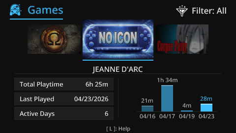
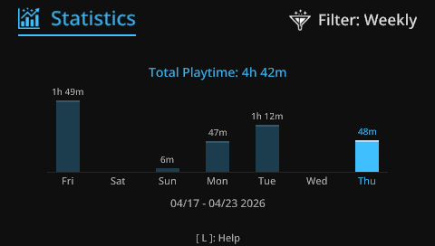

<div align="center">

[](https://github.com/OniMock/GameDiary/actions)
[](https://github.com/OniMock/GameDiary/releases)
[](LICENSE)
[](https://en.wikipedia.org/wiki/PlayStation_Portable)


[](https://game-diary-app.vercel.app/)
[](https://www.gamebrew.org/wiki/GameDiary_PSP)
[](https://www.pspunk.com/psp-homebrew/)
[](https://docs.google.com/spreadsheets/d/1rcNE7YMPR731JNituGIee5ARop7di-FBcygmstWmvJk/edit?usp=sharing)


[](https://github.com/OniMock/GameDiary/releases/latest)

  

  # 🎮 GameDiary
  > Your handheld gaming history, beautifully tracked.

  ### 🌐 [Official Website](https://game-diary-app.vercel.app/) | 📺 [Video Introduction & Tutorial](https://www.youtube.com/watch?v=S2e6iIoxfpM)
</div>

**GameDiary** is a seamless background playtime tracker and stats visualizer for the PlayStation Portable. It bridges the gap between retro hardware and modern ecosystems by automatically building a premium, localized dashboard of your gaming habits.

---

## Table of Contents

1. [Overview](#overview)
2. [Features](#features)
3. [Compatibility List](#-compatibility-list)
4. [Official Website & Web Tools](#-official-website--web-tools)
5. [Screenshots / UI](#screenshots--ui)
6. [How It Works](#how-it-works)
7. [Installation](#installation)
8. [Usage](#usage)
9. [Project Structure](#project-structure)
10. [Configuration](#configuration)
11. [Development](#development)
12. [Plugin Details](#plugin-details)
13. [Roadmap](#roadmap)
14. [Contributing](#contributing)
15. [Support](#support)
16. [License](#license)
17. [Credits](#credits)
18. [Author](#author)


---

## 📖 Overview

**GameDiary** is a background kernel-mode plugin (PRX) and a premium user-mode application (EBOOT) for the PlayStation Portable (PSP).

It exists to give PSP power-users modern, console-like play tracking capabilities. GameDiary automatically monitors the games you play (both native PSP titles and PS1 classics via POPS), records your session lengths, extracts the game icons behind the scenes, and presents all your gaming statistics in a beautiful, modern, and fluid UI.

**Key Benefits:**
* Never lose track of your gaming hours.
* Revisit your gaming history via rich, data-driven graphs.
* Works entirely in the background without affecting game performance.

---

## ✨ Features

### ⚙️ Core
* **Seamless Background Tracking**: Minimal footprint kernel plugin starts silently with your games and records your playtime accurately.
* **Automatic Icon Management**: Automatically extracts `ICON0.PNG`
from EBOOTs and ISOs for a rich visual diary without manual scraping.
### 🎨 UI / UX
- **Premium User Interface**: Fluid carousel navigation, smooth transitions, depth-sorted overlapping icons, and dynamic backgrounds designed to feel like a native PSP OS experience.
- **Detailed Play Statistics**: View individual playtime for every game, total accumulated playtime across your entire library, session history, and detailed activity graphs.
- **Clean and Scalable Text Rendering**: Sharp and readable interface text at any size with full support for multiple languages and character sets.
### 🧩 System
* **Global Internationalization (i18n)**: Fully localized in English, Spanish, Portuguese, Russian, German, French, Italian, Japanese and Chinese with automatic language detection based on PSP system settings.
* **POPS Compatibility**: Reliable tracking and icon parsing for PlayStation 1 classics running via the official emulator.

---

## 📋 Compatibility List

Curious if your favorite game is supported? We maintain an actively updated **[Community Compatibility List (Google Sheets)](https://docs.google.com/spreadsheets/d/1rcNE7YMPR731JNituGIee5ARop7di-FBcygmstWmvJk/edit?usp=sharing)**.

This spreadsheet contains all UMDs, PS1 classics, and Homebrews tested by us and other users. You can also contribute by testing games and adding them to the list!

---

## 🌐 Official Website & Web Tools

Extend your GameDiary experience with our **[Official Web App](https://game-diary-app.vercel.app/)**, designed to manage and refine your collection beyond the handheld.

By using the **Backup / Export** feature in the PSP application, you can generate a `backup.json` file (located in `ms0:/PSP/COMMON/GameDiary/backup.json`) that can be used with our specialized web tools:

*   **Visual Database Editor**: A premium web-based editor to manually add, remove, or fix game sessions on an interactive timeline.
*   **Database Merge Tool**: Safely combine multiple `backup.json` files from different Memory Sticks or PSP consoles into a single, unified master database without losing history.
*   **Modern Management**: Access and refine your gaming stats from any PC or smartphone with a sleek, responsive interface.


> [!TIP]
> Go to **Settings > Backup > Export** in the PSP app to generate the file needed for the web tools.

## 🖼️ Screenshots / UI

<p align="center">
  
</p>

| Home / Carousel | Session Statistics |
| :---: | :---: |
|  |  |
| *Fluid infinite-scrolling game carousel with depth sorting.* | *Detailed left-aligned session statistics with playtime graphs.* |

---

## ⚙️ How It Works

GameDiary operates in two layers:

1. Kernel Plugin (PRX)
   - Tracks game sessions in real-time
2. User Application (EBOOT)
   - Reads and visualizes collected data

## 📦 Installation

### 📋 Requirements
* A PlayStation Portable (PSP 1000/2000/3000 or Go).
* Custom Firmware (CFW) installed (such as PRO, ME, or ARK-4).
* A Memory Stick (or MicroSD to MS adapter).

### 🗂️ Folder Preparation
Ensure you have the latest release downloaded from the [Releases](https://github.com/OniMock/GameDiary/releases) page. The release contains two main components: the App and the Plugin.

### 1. Installing the Plugin (Tracker)
1. Copy the `GameDiary.prx` file to your `SEPLUGINS` folder on your memory stick (`ms0:/SEPLUGINS/` or `ef0:/SEPLUGINS/` for PSP Go).
2. Enable plugin:
    - For ARK-4:
        > ⚠️ **PSP Go Users**
        > If you are using the PSP Go internal storage, replace `ms0:/` with `ef0:/` in all paths.
        + Open `ms0:/SEPLUGINS/plugins.txt` in a text editor.
        + Add the following line to enable tracking for PSP games:
        ```text
        psp, GameDiary.prx, on
        ```
        + To enable PS1 games tracking also add the following line:
        ```text
        ps1, GameDiary.prx, on
        ```
        + To enable Homebrew tracking also add the following line:
        ```text
        game, GameDiary.prx, on
        ```
    - For other CFWs:
        > ⚠️ **PSP Go Users**
        > If you are using the PSP Go internal storage, replace `ms0:/` with `ef0:/` in all paths.
        + Enable for PSP games and Homebrew:
          Add to `ms0:/seplugins/game.txt`:
          ```
          ms0:/seplugins/GameDiary.prx 1
          ```

        + Enable for PS1 games:
          Add to `ms0:/seplugins/pops.txt`:
          ```
          ms0:/seplugins/GameDiary.prx 1
          ```

3. Restart your PSP (or reset VSH).

### 2. Installing the Application (Viewer)
1. Extract the `GameDiary` app folder.
2. Navigate to `ms0:/PSP/GAME/`.
3. Copy the `GameDiary` folder there. Your absolute path should look like `ms0:/PSP/GAME/GameDiary/EBOOT.PBP`.

---

## 🚀 Usage

### ▶️ Launching the App
Simply navigate to your PSP's **Game** menu on the XMB and launch **GameDiary** like any other homebrew.

### 🎮 Controls

| Button | Action |
| :--- | :--- |
| **D-Pad Left/Right** | Navigate carousel / Change tabs |
| **Analog Stick** | Smooth scrolling through the game carousel |
| **Cross (X) / Circle (O)** | Confirm / Back (Respects your PSP's X/O region setting) |
| **Square (□)** | Toggle Game Category filter |
| **START** | Open Main Dashboard Menu |
| **SELECT** | Open Settings Menu (Language, Support, About) |
| **L-Trigger** | Open context-sensitive Help Popup |

### 🔄 Example Workflows
1. **Playing a game**: Boot up a UMD or ISO. The plugin silently detects the game ID, extracts the icon if missing, and begins tracking your playtime.
2. **Reviewing stats**: Run the GameDiary Application from the XMB. Scroll through the carousel to find your game, hit **X** (or **O**) to view your weekly and all-time playtime statistics.

---

## 🏗️ Project Structure

A clean, modular architecture separating kernel plugin operations from user-mode presentation.

```
GameDiary/
├── Makefile                # Build orchestration
├── assets/                 # Icons, backgrounds, and font source files. Used resources for the application
├── assets-src/             # Editable source assets (e.g., SVGs, ICON0.png) used to build and export final application resources
├── lib/                    # Third-party libraries and external dependencies
├── obj/                    # Intermediate build files (.o) generated during compilation (not committed to the repository)
├── include/                # Shared headers and public APIs
├── src/
│   ├── app/                # User-mode UI Application (EBOOT)
│   │   ├── audio/          # Audio management
│   │   ├── config/         # Configuration management
│   │   ├── data/           # Data management
│   │   ├── i18n/           # Internationalization routines and language logic
│   │   ├── render/         # Graphics, font rendering (MSDF), and components
│   │   ├── ui/             # UI components and screens
│   │   └── main.c          # Application entry point
│   │
│   ├── plugin/             # Kernel-mode Tracking Plugin (PRX)
│   │   ├── hooks/          # API hooks for thread & I/O interception
│   │   └── main.c          # Plugin entry point
│   │
│   └── common/             # Shared logic (Data logging, parser utilities)
└── tools/                  # Build and asset processing tools (e.g., resource and font converters)
```

---

## 🛠️ Configuration

GameDiary data is stored inside the `ms0:/PSP/COMMON/GameDiary/` directory to keep your Memory Stick tidy.

* `games.dat`: Master database mapping game IDs to playtime statistics.
* `sessions.dat`: Session log for each game.
* `config.dat`: User-defined preferences. You can override system language strings or toggle UI features here.
* `icons/`: Cloned icons representing your played games, automatically managed by the plugin.

---

## 👨‍💻 Development

GameDiary is built using the standard [pspdev implementation of the PSPSDK](https://github.com/pspdev/pspdev).

### 🧪 Building Locally
1. Ensure `pspdev` is installed and the environment variables (`PSPSDK`, `PATH`) are configured.
2. Clone the repository:
   ```bash
   git clone https://github.com/OniMock/GameDiary.git
   cd GameDiary
   ```
3. Run `make` to compile both the PRX and EBOOT:
   ```bash
   make
   ```
4. The output will be in the `obj` folder.
5. EBOOT.PBP and GameDiary.prx will be in the root folder.

### 🐳 Docker
Alternatively, use the official Docker image to compile without setting up local tools:
```bash
docker run --rm -it -v "${PWD}:/workspace" pspdev/pspdev Make clean all
```

### 🖥️ Running on Emulator
The user-mode application can be tested using [PPSSPP](https://www.ppsspp.org/). Testing the kernel-plugin typically requires a real PSP, though specific module debugging can sometimes be simulated with advanced emulator setups.

---

## 🔌 Plugin Details

The tracking system relies on kernel thread manipulation and syscall hooks to calculate precise uptime accurately.

* **Tracking**: On game boot, the plugin initializes a monitor thread that synchronizes with the `sceKernelGetSystemTime` API, appending delta-time entries to disk upon shutdown or hibernation.
* **Isolation**: All file I/O operations inside `GameDiary.prx` use low-level `sceIo*` functions guarded by thread-safe mutexes to prevent crashes when interacting with active game threads.
* **Limitations**: Some homebrew that aggressively overwrites RAM boundaries or custom interrupts may temporarily pause tracking intervals.

---

## 🗺️ Roadmap

- [x] Background play tracking and database mapping.
- [x] MSDF font rendering with full Latin, Cyrillic, and CJK fallback chains.
- [x] Multi-language support (EN, PT, ES, RU, DE, FR, IT, JP, CN).
- [x] Auto-extraction of `ICON0.PNG` for PS1/POPS Eboots.
- [x] Context-sensitive help and standardized Helper popups.
- [x] Support Homebrew / Ports.
- [x] Beep sound effects.
- [x] Support older CFWs. (Tested in 6.61 PRO C2, 6.60 PRO B9....)
- [x] Official Website for tools.
- [x] Network-based version checker.
- [x] Expand UI features with Dark/Light Theme.
- [x] Export stats to JSON/CSV for external use.
- [ ] Fix plugin for UMD games (GTA, etc).
- [ ] Ongoing maintenance, fixes, and compatibility improvements.

---

## 🤝 Contributing

We welcome contributions! Please adhere to the following guidelines:

1. **Architecture First**: Respect the separation between `app/` and `plugin/`. Avoid kernel functions in the user-mode app unless specifically bridged.
2. **Memory Mindful**: The PSP has limited RAM (32MB/64MB). Avoid unnecessary deep copies and dynamic allocation (`malloc`). Prefer stack allocation where safe.
3. **No C++**: The project is written in C, not C++. Please keep it that way.
4. **Design**: Design and code must be simple and efficient.
5. **Open a PR**: State clearly what your pull request fixes or implements. Ensure your code merges cleanly and builds under `pspdev`.

---

## ☕ Support

If you like this project and want to support its continuous development, consider buying me a coffee or sending a crypto donation!

<table width="100%" cellspacing="0" cellpadding="0">
  <tr>
    <td align="left">
      <strong>Buy Me a Coffee</strong><br><br>
      
    </td>
    <td align="right">
      <strong>Crypto Wallet (EVM)</strong><br><br>
      
    </td>
  </tr>
</table>

## 📝 License

This project is licensed under the [MIT License](LICENSE).

---

## 🌟 Credits

* [pspdev](https://github.com/pspdev/pspdev) SDK and community for maintaining modern PSP toolchains.
* Developers of PRO / ARK-4 CFW for mapping the boundaries of modern PSP kernel development.
* Members of the Reddit [PSP](https://www.reddit.com/r/PSP/) community for testing, feedback, and support throughout development.
* [Gamebrew](https://www.gamebrew.org/wiki/GameDiary_PSP) and [PSPunk](https://www.pspunk.com/psp-homebrew/) for hosting and showcasing the project within the PSP homebrew scene.

## 👤 Author

Developed by [OniMock](https://github.com/OniMock).

---
